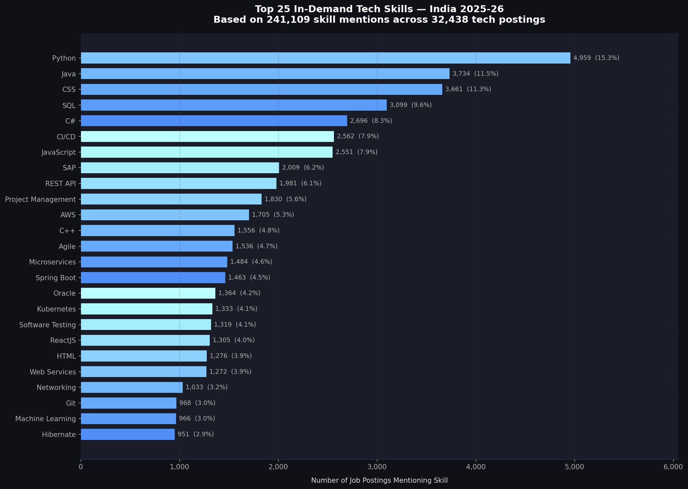
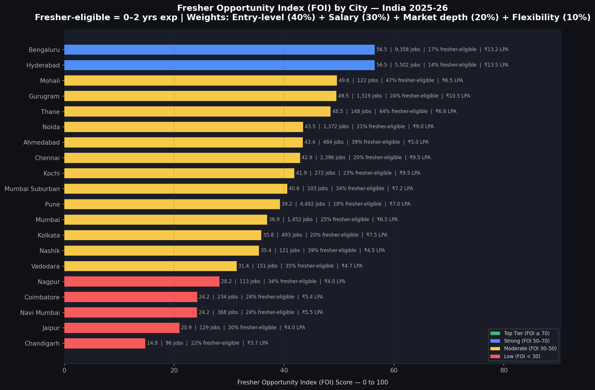
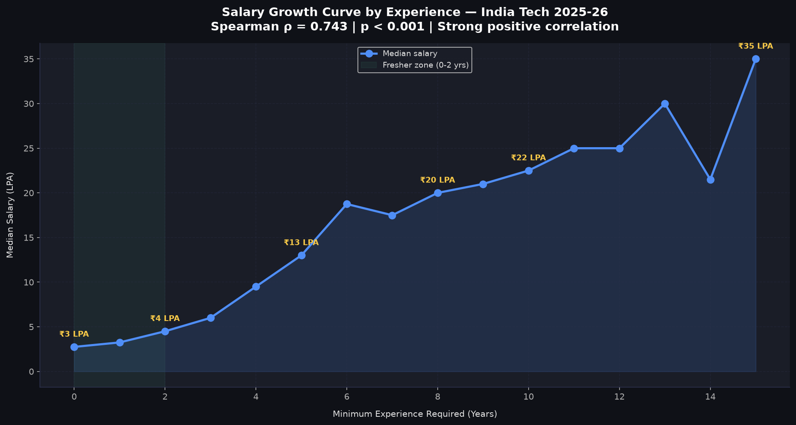
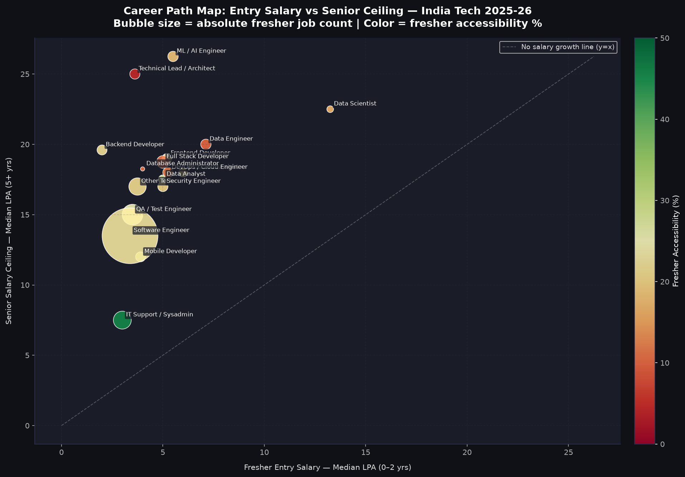

# India Tech Talent Intelligence Platform 2026

> A professional-grade data analytics project analyzing 
> **32,438 tech job postings** from India's largest job portal 
> (Naukri.com) to uncover hiring trends, skill demand, salary 
> intelligence, and fresher opportunity insights for India's 
> technology sector in 2025-26.


---

## 📊 Project Overview

India's tech hiring ecosystem lacks a centralized, data-driven 
intelligence layer connecting real-time skill demand signals with 
salary benchmarks, geographic talent distribution, and fresher 
employability metrics. This platform transforms raw job market 
data into actionable intelligence for both hiring managers and 
fresh graduates.

**Dataset:** Naukri.com India Job Market 2025-26 (Kaggle)  
**Raw Records:** 97,929 job postings  
**Tech Records:** 32,438 (after classification)  
**Skill Mentions:** 241,109 across 18,702 unique skills  
**Companies:** 6,482  
**Cities:** 428  

---

## 🔑 Top 10 Findings

| # | Finding | Key Number |
|---|---------|-----------|
| 1 | Python leads India's tech skill demand | 15.3% of all postings |
| 2 | Only 1 in 5 tech roles is fresher-eligible | 20.21% (6,556 postings) |
| 3 | Hyderabad & Bengaluru offer statistically equal salaries | p = 0.474 |
| 4 | Senior tech roles pay 4.2x more than junior roles | ₹25 vs ₹5.9 LPA |
| 5 | Generative AI commands highest salary premium | +150% above median |
| 6 | Accenture is India's largest fresher employer | 1,088 fresher postings |
| 7 | Tech hiring drops 97% on weekends | 157 vs 5,712 peak day |
| 8 | Spring Boot + Microservices is India's tightest skill pair | Jaccard 0.41 |
| 9 | Skill count has no significant salary correlation | r = 0.020, p = 0.109 |
| 10 | No Indian city achieves Top-Tier FOI score | Best: Bengaluru = 56.5/100 |

---

## 🗺️ Fresher Opportunity Index (FOI)

The FOI is an original composite metric developed for this project 
that ranks Indian cities for fresh graduate tech opportunities:

FOI = Entry-level ratio (40%)
+ Salary competitiveness (30%)
+ Market depth (20%)
+ Work flexibility (10%)

| Rank | City | FOI Score | Tech Jobs | Fresher % | Median Salary |
|------|------|-----------|-----------|-----------|---------------|
| 🥇 1 | Bengaluru | 56.5 | 9,358 | 17% | ₹13.2 LPA |
| 🥇 1 | Hyderabad | 56.5 | 5,502 | 14% | ₹13.5 LPA |
| 🥉 3 | Mohali | 49.6 | 122 | 47% | ₹6.5 LPA |
| 4 | Gurugram | 49.5 | 1,319 | 24% | ₹10.5 LPA |
| 5 | Thane | 48.5 | 148 | 44% | ₹6.6 LPA |

---

## 🛠️ Tech Stack

| Layer | Tools Used |
|-------|-----------|
| **Data Collection** | Kaggle (Naukri.com scrape) |
| **Data Cleaning** | Python, Pandas, NumPy, Regex |
| **Exploratory Analysis** | Pandas, Matplotlib, Seaborn, Plotly |
| **Statistical Analysis** | SciPy (Mann-Whitney U, Pearson, Spearman) |
| **Advanced Analytics** | Jaccard Similarity, Composite Scoring |
| **Visualization** | Matplotlib (25 charts), Power BI (4-page dashboard) |
| **Documentation** | Markdown, Jupyter Notebooks |
| **Version Control** | Git, GitHub |

---

## 📁 Project Structure

india-tech-talent-intelligence-2026/
│
├── 📁 data/
│   ├── raw/                    ← Original dataset (not tracked)
│   ├── processed/              ← Cleaned CSVs
│   └── external/               ← Reference data
│
├── 📁 notebooks/
│   ├── 01_data_understanding.ipynb
│   ├── 02_data_cleaning.ipynb
│   ├── 03_exploratory_analysis.ipynb
│   ├── 04_statistical_analysis.ipynb
│   └── 05_advanced_analytics.ipynb
│
├── 📁 outputs/
│   ├── charts/                 ← 25 analysis charts (PNG)
│   ├── tables/                 ← Key result tables (CSV)
│   └── reports/                ← Executive insights (MD)
│
├── 📁 powerbi/                 ← Dashboard (.pbix + screenshots)
├── 📁 scripts/                 ← Reusable Python functions
├── 📁 sql/                     ← SQL analysis queries
└── 📁 docs/                    ← Methodology & data dictionary

---

## 📈 Dashboard Preview

### Page 1 — Executive Overview


### Page 2 — Skill Intelligence  


### Page 3 — Salary & Location


### Page 4 — Fresher Opportunity Index


---

## 📊 Key Charts

### Top 25 In-Demand Tech Skills


### Fresher Opportunity Index by City


### Salary Growth by Experience


### Career Path Map


---

## 🚀 How to Run This Project

### Prerequisites
```bash
# Clone the repository
git clone https://github.com/Piyush1228/india-tech-talent-intelligence-2026.git
cd india-tech-talent-intelligence-2026

# Create and activate conda environment
conda create -n talent_intel python=3.11
conda activate talent_intel

# Install dependencies
pip install -r requirements.txt
```

### Dataset Setup
1. Download the dataset from Kaggle:  
   [India Job Market Dataset 2025](https://www.kaggle.com/datasets/shivamshrivastava21/indian-job-market-dataset-2025-2026)
2. Place `india_job_market_2025.csv` in `data/raw/`

### Run Notebooks in Order
```bash
# Open Jupyter
jupyter notebook

# Run in this sequence:
# 01_data_understanding.ipynb
# 02_data_cleaning.ipynb
# 03_exploratory_analysis.ipynb
# 04_statistical_analysis.ipynb
# 05_advanced_analytics.ipynb
```

---

## 📋 Business Questions Answered

This project answers 30 business questions across 5 domains:

**Skill Intelligence:** Which skills are most demanded? Which 
skills co-occur most frequently? What is the minimum viable 
fresher skill set?

**Salary Intelligence:** Which roles pay the most? Which cities 
offer the highest salaries? Which skills command salary premiums?

**Location Intelligence:** Which cities have the most tech jobs? 
Which cities are best for freshers? What is the work mode split?

**Role Intelligence:** Which roles are growing fastest? Which are 
most accessible to freshers? What is the career path salary curve?

**Company Intelligence:** Who are the top hirers? Which companies 
hire the most freshers? How does company rating relate to salary?

---

## 📌 Data Cleaning Highlights

- Removed 571 rows with systemic scraping failures
- Resolved 247 full duplicate records
- Built keyword-based tech role classifier (v3, ~90% precision)
- Extracted `primary_city` from 10,066 unique location strings
- Normalized 18,702 raw skill variants into canonical forms
- Identified and corrected 87 monthly-to-annual salary anomalies
- Final dataset: 32,438 tech postings, 0.84% removal rate

---

## 🔮 Future Enhancements

- [ ] Real-time data pipeline using Naukri API
- [ ] NLP-based skill extraction from job descriptions
- [ ] Salary prediction ML model (Random Forest)
- [ ] Interactive web dashboard (Streamlit)
- [ ] Time-series trend analysis with monthly scrapes
- [ ] Resume-to-job-match scoring system

---

## 👤 About

**Piyush** — B.Tech Information Technology, RTU Kota (CGPA 8.45)  
Seeking roles in Data Analytics, Business Analysis, and AI  

[](https://linkedin.com/in/piyyush-kumar/)
[](https://github.com/Piyush1228)

---

## 📄 License

This project is licensed under the MIT License.  
Dataset credit: Naukri.com India Job Market 2025-26 via Kaggle.
